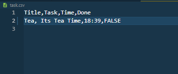
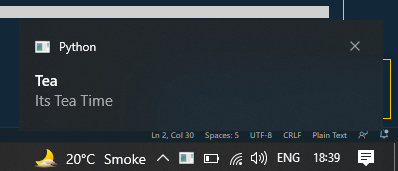

# Task notify in Windows

**In First Run it Will Create `task.csv` file**
```
$ python main.py 
Fill the rows of your task in Current created file and Rerun this program!
```
***
**Add task in `task.csv` file and Rerun**



***

**Output**

